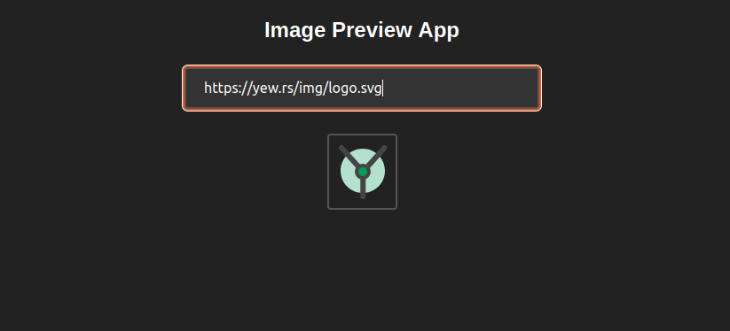

# Image Preview V1


A image preview application powered by Yew.



## Building and Running

1. Fork/Clone the GitHub repository.

	```bash
	git clone https://github.com/wiseaidev/image-preview-v1
	```

1. Navigate to the application directory.

	```bash
	cd image-preview-v1
	```

1. Run the client:

	```sh
	trunk serve --port 3000
	```

Navigate to http://localhost:3000 to explore the app.

## License

This project and the accompanying materials are made available under the terms and conditions of the [` Apache License Version 2.0`](https://github.com/wiseaidev/image-preview-v1/blob/main/LICENSE).
